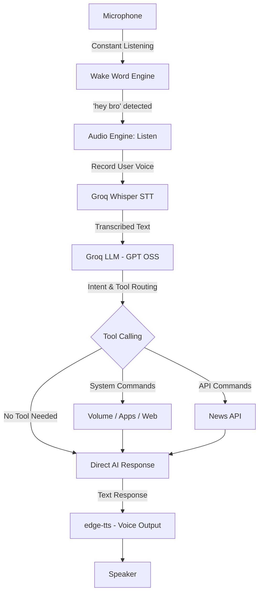

# 🤖 Bro - Voice Assistant (Jarvis-inspired)

A highly capable, Python-based, voice-activated virtual assistant named **"Bro"**. This project combines local command execution, intelligent system control, and the power of the **Groq API** to provide lightning-fast, intelligent responses and advanced tool calling.

---

## 🌟 Features

- **Voice Activation:** Constantly listens in the background. Wakes up when it hears the keyword ("hey bro").
- **Hybrid Input Mode:** Type commands directly into the terminal or use voice concurrently—no need to choose one or the other.
- **Ultra-Fast Intelligence:** Powered by **Groq** (`openai/gpt-oss-120b`) for near-instant conversational responses and advanced function calling.
- **High-Fidelity STT:** Uses **Groq's Whisper** (whisper-large-v3) for highly accurate speech-to-text transcription.
- **Natural Voice (TTS):** Uses Microsoft's **edge-tts** for asynchronous, high-quality, and natural-sounding voice responses.
- **System Automation & Control:** 
  - Change system volume dynamically.
  - Open and close local PC applications.
  - Execute web searches and open popular websites.
- **Native YouTube Scraper:** Programmatically searches and plays requested videos/music natively on YouTube, bypassing hardcoded libraries.
- **News Integration:** Fetches top news headlines dynamically using the NewsAPI.
- **Stealth Terminal Output:** Clean, production-ready console logging that hides internal workflows and API calls.

---

## 🏗️ System Architecture & Workflow

The architecture transitioned from a traditional `if-elif` hardcoded command structure to a modern **LLM-driven Tool Calling** architecture.



---

## 🛠️ Tech Stack & Dependencies

| Dependency | Purpose | Documentation |
|------------|---------|---------------|
| **`groq`** | LLM Engine & Whisper STT | [Groq Docs](https://console.groq.com/docs) |
| **`edge-tts`** | High-quality Text-to-Speech (Microsoft Edge) | [edge-tts GitHub](https://github.com/rany2/edge-tts) |
| **`speech_recognition`** | Wake Word detection via Google Web Speech API | [SpeechRecognition Docs](https://pypi.org/project/SpeechRecognition/) |
| **`python-dotenv`** | Secure management of API keys | [python-dotenv Docs](https://pypi.org/project/python-dotenv/) |
| **`pycaw`** | Windows audio management (Volume Control) | [pycaw GitHub](https://github.com/AndreMiras/pycaw) |
| **`psutil`** | Cross-platform process utilities (App Management) | [psutil Docs](https://psutil.readthedocs.io/en/latest/) |
| **`pygame`** | Asynchronous audio playback (TTS audio files) | [Pygame Docs](https://www.pygame.org/docs/) |
| **`pyaudio`** | Audio stream management for recording | [PyAudio Docs](https://people.csail.mit.edu/hubert/pyaudio/) |

---

## ⚙️ Prerequisites & Setup

Ensure you have **Python 3.10+** installed on Windows. 

### 1. API Keys Needed
Create a `.env` file in the root directory (`d:\BRO\.env`) and add the following keys:
```env
GROQ_API_KEY=your_groq_api_key_here
NEWS_API_KEY=your_news_api_key_here
```
*(Get your Groq API key [here](https://console.groq.com/keys) and NewsAPI key [here](https://newsapi.org/).)*

### 2. Installation Procedures

1. **Clone the Repository:**
   ```powershell
   git clone https://github.com/pratyush06-aec/BRO.git
   cd BRO
   ```
2. **Create and Activate a Virtual Environment:**
   ```powershell
   python -m venv .venv
   .\.venv\Scripts\activate
   ```
3. **Install Dependencies:**
   ```powershell
   pip install -r requirements.txt
   ```

---

## 🚀 How to Run

1. Ensure your microphone is properly configured.
2. Activate your virtual environment (`.\.venv\Scripts\activate`).
3. Run the main application file:
   ```powershell
   python main.py
   ```
4. The system will print `Adjusting for ambient noise... Please wait.` Let it calibrate in silence for 2 seconds.
5. The terminal will display `--- TEXT MODE ENABLED ---`.
6. From here, you have two options:
   - **Voice:** Say **"hey bro"** to activate it. It will reply **"Yeah Bro?"** and you can speak your command.
   - **Text:** Simply type your command into the terminal and press Enter.
7. Give it a command! (e.g., *"Play Honey Singh on YouTube"* or *"Open calculator"*).

---

## 📁 Project Structure

- `main.py`: The core application loop and conversation memory manager.
- `wake_word.py`: Handles ambient noise calibration and continuous wake word detection.
- `audio_engine.py`: Manages Groq Whisper (STT) recording/transcription and `edge-tts` (TTS) playback.
- `system_controls.py`: Contains Windows-specific functions to control volume, open apps, and search the web.
- `tools.py`: Maps python functions to the Groq LLM tool schemas (`AVAILABLE_TOOLS`).
- `requirements.txt`: Locked dependencies for the virtual environment.
- `musicLibrary.py`: Maps specific song names to YouTube links.
